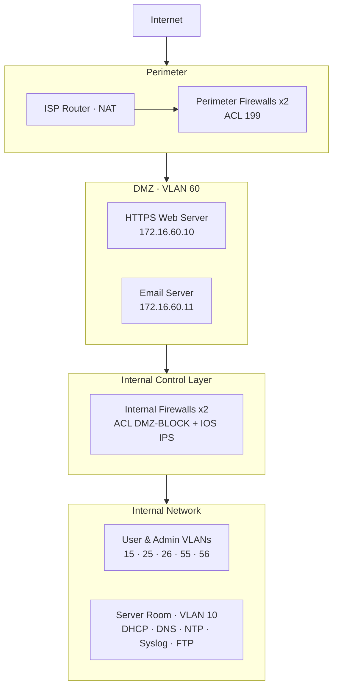
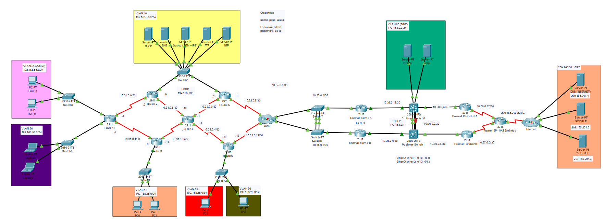

# Secure Network Architecture for the Banking Sector — Banco FinanCR


Design, simulated implementation, and security evaluation of a segmented, highly available network for **Banco FinanCR S.A.**, a fictional mid-to-large national bank. The architecture applies **defense in depth** and **least privilege**, and was built and validated in **Cisco Packet Tracer**.

---

## Table of Contents

- [Problem](#problem)
- [Architecture](#architecture)
- [Network Segmentation](#network-segmentation)
- [Security Controls](#security-controls)
- [High Availability](#high-availability)
- [Network Services](#network-services)
- [Validation](#validation)
- [Limitations](#limitations)
- [Repository Structure](#repository-structure)
- [How to Open the Project](#how-to-open-the-project)

---

## Problem

The bank (~450 employees, ~380 active network users, 1 headquarters + 4 regional branches, primary and backup data centers) faced:

- **No network segmentation**: users and critical systems shared the same network space, enabling **lateral movement**.
- **Exposed public services** (web banking, email) without isolation from the internal network.
- **Strict availability requirements** for online banking and electronic payments.
- **Hybrid environment** (on-premises, virtualization, and cloud backups) requiring controlled communications.

## Architecture

The topology models the **headquarters**; branches replicate the same design and are represented through generic WAN router links.



Traffic must cross **three layers of control** (perimeter firewalls → internal firewalls with IPS → ACLs protecting the server room) before reaching sensitive data.

<!-- Add the Packet Tracer topology screenshot here -->
<!--  -->

## Network Segmentation

The network is divided into **7 VLANs** with dedicated subnets, routed via **Router-on-a-stick** subinterfaces and Layer 3 switches.

| VLAN | Purpose | Subnet |
| --- | --- | --- |
| 10 | Server room (internal services) | 192.168.10.0/24 |
| 15 | Internal users | 192.168.15.0/24 |
| 25 | Internal users | 192.168.25.0/24 |
| 26 | Internal users | 192.168.26.0/24 |
| 55 | Administration | 192.168.55.0/24 |
| 56 | Internal users | 192.168.56.0/24 |
| 60 | DMZ (public services) | 172.16.60.0/24 |

**Key internal servers (VLAN 10):**

| Service | IP |
| --- | --- |
| DHCP | 192.168.10.2 |
| DNS | 192.168.10.3 |
| Syslog | 192.168.10.4 |
| FTP (database / cloud backup) | 192.168.10.5 |
| NTP | 192.168.10.6 |

## Security Controls

### Perimeter firewalls (redundant pair)

Mirrored configuration on both firewalls. **ACL 199** is applied inbound on the serial interfaces facing the Internet and only publishes specific DMZ services:

```
Extended IP access list 199
 20 permit tcp any host 172.16.60.10 eq 443        ! HTTPS to web server
 30 permit tcp any host 172.16.60.11 eq pop3       ! Email (POP3)
 40 permit tcp any host 172.16.60.11 eq smtp       ! Email (SMTP)
 50 permit icmp any host 172.16.60.10 echo
 60 permit icmp any host 172.16.60.11 echo
 70 permit icmp any host 172.16.60.10 echo-reply
 80 permit icmp any host 172.16.60.11 echo-reply
 90 permit tcp any any established                 ! Return traffic
100 permit ospf any any                            ! Routing with ISP
110 permit icmp any any echo-reply
120 deny   ip any any                              ! Deny everything else
```

### Internal firewalls (redundant pair)

Second line of defense between the DMZ/Internet and the internal network. **Only traffic initiated from inside is allowed back in**, so a compromised DMZ cannot reach internal hosts.

```
Extended IP access list DMZ-BLOCK
 10 permit ospf any any
 30 permit tcp any any established
 40 permit icmp any any echo-reply
 50 deny   ip any any
```

### Server room protection (least privilege)

**ACL FILTRO-VLAN10** on R2 and R5 restricts access to the server room. Only the **Administration VLAN (55)** and intermediate routers get unrestricted access; everyone else can only reach the specific services they need.

```
Extended IP access list FILTRO-VLAN10
 10 permit ip 192.168.55.0 0.0.0.255 192.168.10.0 0.0.0.255   ! Admin VLAN
 20 permit udp any host 192.168.10.2 eq bootps                 ! DHCP
 30 permit udp any host 192.168.10.2 eq bootpc
 40 permit tcp any host 192.168.10.3 eq domain                 ! DNS
 50 permit udp any host 192.168.10.3 eq domain
 60 permit udp any host 192.168.10.6 eq 123                    ! NTP
 70 permit udp any host 192.168.10.4 eq 514                    ! Syslog
 80 permit ospf any any
 90 permit icmp any any echo-reply
100 permit ip 10.0.0.0 0.255.255.255 192.168.10.0 0.0.0.255    ! Routers
110 deny   ip any 192.168.10.0 0.0.0.255                       ! Block the rest
120 permit ip any any                                          ! DMZ / Internet
```

### Intrusion Prevention System (Cisco IOS IPS)

Enabled inbound on the internal firewall interface facing the DMZ/Internet. Only the `ios_ips basic` signature category is active to save router resources. Signature **2004** (ICMP echo) is configured to **alert and drop** packets, and alerts are forwarded to the Syslog server.

```
ip ips config location flash:mkdir retries 1
ip ips name IOS-IPS
ip ips signature-category
 category all
  retired true
 category ios_ips basic
  retired false
!
ip ips signature-definition
 signature 2004 0
  status
   retired false
   enabled true
  engine
   event-action produce-alert
   event-action deny-packet-inline
!
interface GigabitEthernet0/0
 ip ips IOS-IPS in
 ip access-group DMZ-BLOCK in
```

### Device hardening (Cisco AutoSecure)

Applied to routers: password encryption (`service password-encryption`, `enable secret`), AAA local authentication, disabled unnecessary services (e.g. `no cdp run`), and a legal warning banner.

### NAT

Configured on the ISP router: a **dynamic NAT pool** for outbound Internet access and **static NAT** to publish only the DMZ services.

```
ip nat pool NAT-POOL1 209.165.200.230 209.165.200.254 netmask 255.255.255.224
ip nat inside source list NAT-HOSTS pool NAT-POOL1
ip nat inside source static tcp 172.16.60.10 443 209.165.200.225 443
ip nat inside source static tcp 172.16.60.11 110 209.165.200.227 110
```

## High Availability

| Technology | Implementation | Benefit |
| --- | --- | --- |
| **HSRP** | Layer 3 switches share virtual gateway `172.16.60.1` (active priority 110, preempt) | Gateway failover without losing connectivity |
| **EtherChannel** | PAgP port-channels between Layer 3 switches | More bandwidth and link redundancy |
| **OSPF** | Multi-area dynamic routing with link costs defining primary and backup paths | Automatic rerouting on link failure |
| **Redundant firewalls** | Two perimeter and two internal firewalls with mirrored configs | No single point of failure at security layers |

## Network Services

| Service | Role in the design |
| --- | --- |
| **DHCP** | Centralized server with one address pool per VLAN |
| **DNS** | Internal resolution of the bank's domain and external domains |
| **NTP** | Time sync across all routers for consistent log timestamps |
| **Syslog** | Centralized event logging from routers and IPS alerts (foundation for a SIEM) |
| **HTTPS** | Bank web portal hosted in the DMZ, encrypted with TLS |

## Validation

Every control was verified with a functional test:

| Test | Result |
| --- | --- |
| Ping within the same VLAN and between VLANs | ✅ Success |
| Internal host → DNS server and Internet (`ping google.com`) | ✅ Success |
| DHCP assignment in VLANs 15 and 55 | ✅ IP, gateway, and DNS received |
| NTP sync (`show ntp status` on R5 and R8) | ✅ Synchronized |
| Syslog server receiving events from multiple devices | ✅ Logs received |
| NAT translation table (`show ip nat translations`) | ✅ Private → public translations |
| AutoSecure: login prompt and warning banner via Telnet | ✅ Authentication required |
| OSPF routes (`show ip route` on R6) | ✅ Dynamic routes learned |
| HSRP roles (`show standby`) | ✅ Active / standby |
| EtherChannel status (`show etherchannel summary`) | ✅ Port-channels up |
| Internet → internal VLAN 26 | ✅ **Blocked** (expected) |
| External host → bank website over HTTPS | ✅ Success |
| VLAN 55 (Admin) → FTP server | ✅ Allowed |
| VLAN 15 → FTP server | ✅ **Blocked** (expected) |
| DMZ → internal network | ✅ **Blocked by IPS**, alert sent to Syslog |

## Limitations

Packet Tracer does not support every production technology, so some elements are conceptual:

- **Cloud backups** are represented implicitly through the FTP server.
- **IDS/IPS** is limited to Cisco IOS IPS with basic signatures; a full IDS/IPS appliance is proposed for the internal control layer.
- **Firewalls are stateless** (ACL-based), relying on `established` for return traffic.
- **Telnet** was used for access tests; in production, device management should use **SSH only**.
- **SIEM, MFA, and encryption at rest** appear in the conceptual architecture but are not simulated.

**Recommended next steps:** dedicated IDS/IPS, periodic security audits, patch management, MFA on critical access, security awareness training, and a full backup and disaster recovery strategy.

## Repository Structure

```
├── README.md
├── topology/
│   └── Banco_FinanCR.pkt          # Cisco Packet Tracer project
└── images/
    └── topology.png               # Topology screenshot
```

## How to Open the Project

1. Install [Cisco Packet Tracer](https://www.netacad.com/cisco-packet-tracer) (free with a Cisco Networking Academy account).
2. Open `topology/Banco_FinanCR.pkt`.
3. Use the **Desktop → Command Prompt** of any PC to run the connectivity tests, or the **CLI** tab of routers and switches to inspect configurations (`show running-config`, `show ip route`, `show standby`, `show access-lists`).
